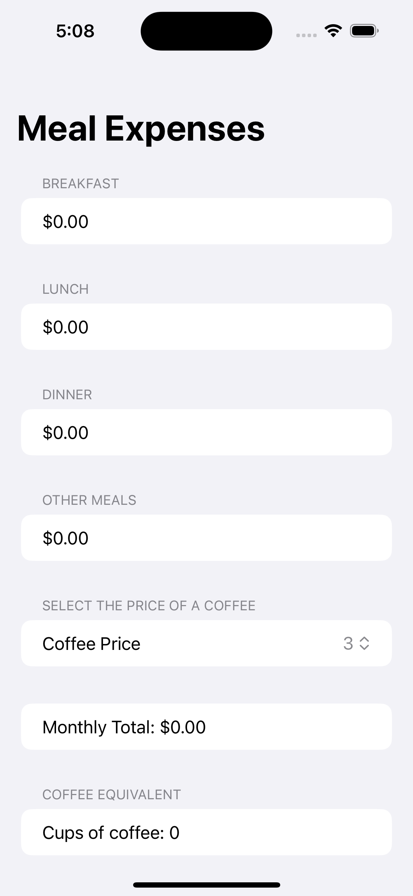
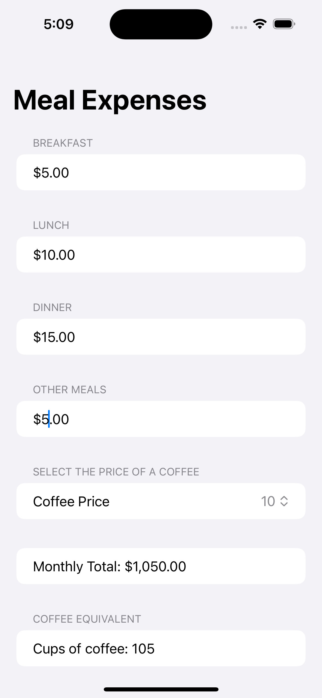

# Meal Expenses App

## Overview
The Meal Expenses app is a simple yet efficient way to keep track of your daily meal costs and understand how they translate into monthly expenses. Additionally, it provides a fun feature to equate your monthly total to the number of cups of coffee you could buy.

## Features
- Enter your meal costs for breakfast, lunch, dinner, and other meals.
- Select the cost of a coffee from predefined values using a picker.
- View the total monthly cost based on the daily input multiplied by 30 days.
- Calculate how many cups of coffee you can buy with your monthly meal expenses.

## SwiftUI Code
The app is built using SwiftUI and is composed of a single view, `ContentView`, which contains state variables for breakfast, lunch, and dinner costs, as well as other meals and the coffee price. It uses a `NavigationView` and a `Form` to take user input and display calculated results.

## How to Use
To use the app, simply input the cost of your meals in the respective fields and select your usual coffee price. The app will automatically calculate and display your total monthly expenses and how many cups of coffee this equals to.

## Screenshots

    
    

